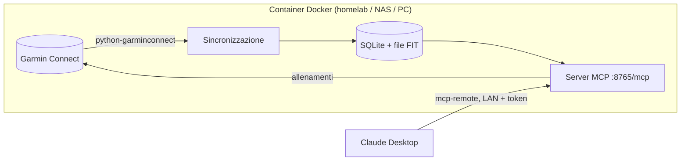

# garmin-coach-mcp

**Claude legge i tuoi dati di corsa Garmin e ti mette gli allenamenti sull'orologio.**

`garmin-coach-mcp` è un piccolo servizio self-hosted che tiene un archivio locale delle tue attività
Garmin Connect (riepiloghi, lap e dati secondo per secondo dai file FIT originali) e lo rende disponibile a
[Claude Desktop](https://claude.ai/download) tramite il [Model Context Protocol](https://modelcontextprotocol.io).
Può anche creare allenamenti strutturati e programmarli nel tuo calendario Garmin.

Basta esportare CSV dopo ogni corsa: chiedi e basta.

> *"Sincronizza e analizza la corsa di stamattina: com'è andata la deriva cardiaca negli ultimi 5 km?"*
> *"Confronta i lunghi delle ultime 8 settimane: passo, frequenza cardiaca, cadenza."*
> *"Mettimi sull'orologio la seduta di mercoledì: 15' facili, 3 × 2 km a 5:40-5:45 con 2' di corsa lenta, 10' di defaticamento."*

🇬🇧 [English version](README.md)

---

## Indice

- [Cosa fa](#cosa-fa)
- [Come funziona](#come-funziona)
- [Requisiti](#requisiti)
- [Installazione](#installazione)
- [Collegare Claude Desktop](#collegare-claude-desktop)
- [Note personali per Claude](#note-personali-per-claude)
- [Strumenti](#strumenti)
- [Allenamenti strutturati](#allenamenti-strutturati)
- [Configurazione](#configurazione)
- [Manutenzione](#manutenzione)
- [Risoluzione problemi](#risoluzione-problemi)
- [Dati, privacy e sicurezza](#dati-privacy-e-sicurezza)
- [Limiti e avvertenze](#limiti-e-avvertenze)
- [Ringraziamenti](#ringraziamenti)

---

## Cosa fa

**Il tuo storico, sempre disponibile**
- Importa una volta tutto lo storico, poi scarica le attività nuove ogni 30 minuti (o su richiesta).
- Per ogni corsa salva il FIT originale ed estrae lap e dati secondo per secondo: passo, frequenza cardiaca,
  cadenza, dinamiche di corsa (tempo di contatto e bilanciamento, oscillazione e rapporto verticale,
  lunghezza del passo), potenza, altimetria, GPS.
- Passo corretto per la pendenza su ogni lap e scarpe assegnate su Garmin Connect.

**Strumenti pronti per l'analisi**
- Singola attività: riepilogo, lap (stesso contenuto del CSV per lap di Garmin), tempo nelle fasce cardiache,
  recupero cardiaco a 60".
- Serie temporali a qualsiasi risoluzione: deriva cardiaca, crisi, analisi delle ripetute.
- Riepiloghi settimanali: volume, lungo, carico, distribuzione dell'intensità.
- SQL in sola lettura per tutto il resto (andamenti su mesi, confronti, record).
- Annotazioni per quello che Garmin non sa o sbaglia: temperatura reale, tapis roulant, scarpe, RPE, note.

**Allenamenti sull'orologio**
- Claude scrive allenamenti di corsa strutturati (riscaldamento, ripetute, recuperi, defaticamento, target di passo
  o di frequenza cardiaca) e li programma nel calendario Garmin: arrivano sull'orologio al sync successivo.
- Sempre anteprima prima, caricamento solo dopo il tuo ok.

---

## Come funziona



- Il container parla con Garmin Connect con il tuo account (stesso login dell'app Garmin Connect).
- Tutto resta in locale nella cartella `./data`: niente viene inviato altrove.
- Claude Desktop si collega al container sulla rete di casa tramite
  [`mcp-remote`](https://github.com/geelen/mcp-remote), con un token.

---

## Requisiti

| Dove | Cosa |
|---|---|
| Server (una macchina sempre accesa: VM homelab, NAS, Raspberry Pi 4/5, PC) | Docker + Docker Compose |
| Il tuo computer | [Claude Desktop](https://claude.ai/download) e [Node.js](https://nodejs.org) LTS (per `npx`) |
| Garmin | Un account Garmin Connect (MFA supportato) |

Server e computer devono stare sulla stessa rete (o raggiungersi via VPN).

---

## Installazione

### 1. Scarica il codice sul server

```bash
git clone https://github.com/fabio983/garmin-coach-mcp.git
cd garmin-coach-mcp
```

### 2. Configura

```bash
cp .env.example .env
openssl rand -hex 32        # copia il risultato in MCP_TOKEN dentro .env
nano .env                   # imposta TZ, BACKFILL_FROM, HR_BANDS...
```

Tutte le opzioni sono in [Configurazione](#configurazione).

### 3. Build

```bash
docker compose build
```

### 4. Login a Garmin (una volta)

```bash
docker compose run --rm garmin-coach login
```

Inserisci email, password e, se attivo, il codice MFA. I token vengono salvati in `data/tokens/`;
la password non viene salvata.

> Avvisi come `mobile+cffi returned 429` durante il login sono normali: la libreria prova più metodi
> di login e uno dei successivi va a buon fine. Conta il `Login OK` finale.

### 5. Avvia

```bash
docker compose up -d
docker compose logs -f
```

Al primo avvio importa lo storico da `BACKFILL_FROM`. Ogni corsa richiede circa 7 secondi
(FIT + split + scarpe, con pause per rispettare i limiti di Garmin): ~300 corse ≈ 35 minuti.
Vedrai una riga `Details <id> (running) ok` per corsa e alla fine `Auto sync: ok`.

Verifica dal computer che il server risponda:

```bash
curl http://IP-SERVER:8765/healthz      # → ok
```

---

## Collegare Claude Desktop

1. Installa **Node.js LTS** sul computer (Windows: `winget install OpenJS.NodeJS.LTS`), poi apri un nuovo terminale
   e controlla `node -v`.
2. In Claude Desktop apri **Impostazioni → Sviluppatore → Modifica configurazione**. Si apre `claude_desktop_config.json`:
   - Windows: `%APPDATA%\Claude\claude_desktop_config.json`
   - macOS: `~/Library/Application Support/Claude/claude_desktop_config.json`
3. Aggiungi il blocco `garmin-coach` dentro `mcpServers`
   (vedi [`examples/claude_desktop_config.json`](examples/claude_desktop_config.json)):

   ```json
   {
     "mcpServers": {
       "garmin-coach": {
         "command": "npx",
         "args": ["-y", "mcp-remote@latest", "http://IP-SERVER:8765/mcp",
                  "--allow-http", "--transport", "http-only",
                  "--header", "Authorization:${AUTH_HEADER}"],
         "env": { "AUTH_HEADER": "Bearer IL_TUO_MCP_TOKEN" }
       }
     }
   }
   ```

   Se il file contiene già altre chiavi (per esempio `preferences`), lasciale: `mcpServers` va al primo livello,
   separato da una virgola. Se `mcpServers` esiste già, aggiungi `garmin-coach` al suo interno.
4. **Chiudi Claude del tutto** (su Windows anche dall'icona in basso a destra) e riaprilo.
   Chiudi Claude *prima* di salvare il file, altrimenti uscendo potrebbe sovrascrivere la modifica.
5. In **Impostazioni → Sviluppatore** deve comparire `garmin-coach` *in esecuzione*.
6. Apri una **nuova** chat e chiedi: *"Com'è messo il mio archivio Garmin?"*

La forma `Authorization:${AUTH_HEADER}` (senza spazio dopo i due punti) evita un problema noto con gli spazi
negli argomenti su Windows.

---

## Note personali per Claude

Claude lavora meglio se conosce il tuo contesto: sensori, zone cardiache, cadenza obiettivo,
a cosa servono le varie scarpe. Scrivilo in `data/athlete.md`:

```bash
cp examples/athlete.example.md data/athlete.md
nano data/athlete.md
docker compose restart
```

Il file viene aggiunto alle istruzioni che il server dà a Claude in ogni chat. Sta in `data/`,
quindi non finisce mai nel repository.

---

## Strumenti

| Strumento | Cosa fa |
|---|---|
| `sync_garmin` | Scarica subito le attività nuove (`full=true` reimporta tutto in background) |
| `sync_status` | Conteggi dell'archivio, periodo coperto, esito degli ultimi sync |
| `list_activities` | Attività in un periodo, filtrabili per tipo |
| `get_activity` | Riepilogo, lap, HRR60, tempo nelle fasce cardiache, annotazioni (`latest`, una data o un id) |
| `get_activity_series` | Dati secondo per secondo mediati ogni N secondi, anche su una finestra di tempo |
| `training_summary` | Riepilogo settimanale: uscite, km, tempo, passo, lungo, carico, distribuzione FC |
| `annotate_activity` | Salva temperatura reale, umidità, tapis, scarpe, tipo seduta, RPE, HRR, note |
| `query_sql` | SQL in sola lettura sull'archivio (schema nella descrizione dello strumento) |
| `create_workout` | Crea un allenamento strutturato: anteprima → conferma → caricamento e programmazione |
| `get_workout` | Mostra i passi di un allenamento salvato su Garmin Connect |
| `list_workouts` | Allenamenti in calendario e ultimi della libreria |
| `delete_workout` | Toglie dal calendario e/o elimina un allenamento (solo su tua richiesta) |

---

## Allenamenti strutturati

Claude costruisce gli allenamenti da una semplice lista di passi. Non serve scriverla a mano:
descrivi la seduta a parole e Claude la traduce. Per riferimento:

```json
[
  {"kind": "warmup", "time": "15:00", "hr": "120-145", "note": "facile"},
  {"repeat": 4, "steps": [
    {"kind": "interval", "distance_m": 100, "note": "allungo"},
    {"kind": "recovery", "time": "0:45", "note": "cammina"}
  ]},
  {"repeat": 3, "steps": [
    {"kind": "interval", "distance_km": 2, "pace": "5:40-5:45"},
    {"kind": "recovery", "time": "2:00", "note": "corsa lenta"}
  ]},
  {"kind": "cooldown", "time": "10:00"}
]
```

| Campo | Valori |
|---|---|
| `kind` | `warmup`, `interval`, `recovery`, `rest`, `cooldown`, `other` |
| durata (una) | `time` (`"mm:ss"`), `distance_km`, `distance_m`, `lap: true` (fino al tasto lap) |
| target (facoltativo, uno) | `pace` (`"m:ss-m:ss"` al km) oppure `hr` (`"min-max"` bpm) |
| `note` | Testo breve mostrato sull'orologio in quel passo |
| ripetizione | `{"repeat": N, "steps": [...]}`, anche annidate |

I target Garmin hanno sempre due limiti. Per "più lento di 7:00/km" usa un range largo (es. `7:00-7:45`)
o un tetto di frequenza cardiaca (es. `hr: "120-145"`).

Flusso: Claude mostra un'**anteprima**, tu confermi, poi carica l'allenamento e (con una data) lo programma.
Con `replace_workout_id` riscrive un allenamento esistente mantenendo le date in calendario.

---

## Configurazione

Tutte le impostazioni stanno in `.env` (vedi [`.env.example`](.env.example)).

| Variabile | Default | Descrizione |
|---|---|---|
| `MCP_TOKEN` | – | Token richiesto dall'endpoint MCP. **Da impostare.** |
| `TZ` | – | Fuso orario, es. `Europe/Rome` |
| `BACKFILL_FROM` | `2024-01-01` | Data di inizio della prima importazione |
| `SYNC_INTERVAL_MIN` | `30` | Intervallo del sync automatico (0 = solo su richiesta) |
| `REQUEST_DELAY_S` | `1.5` | Pausa tra le chiamate a Garmin |
| `HR_BANDS` | `135,150,160,170` | Soglie inferiori delle fasce FC 2..N per il tempo in zona |
| `DETAIL_TYPE_MATCH` | `run` | Tipi di attività (sottostringa del `typeKey` Garmin) per cui scaricare FIT/lap/record |
| `GARMIN_EMAIL` / `GARMIN_PASSWORD` | – | Facoltative, per il re-login automatico (non con MFA) |
| `ATHLETE_FILE` | `/data/athlete.md` | Note personali aggiunte alle istruzioni per Claude |
| `MCP_PORT` | `8765` | Porta nel container |

---

## Manutenzione

| Operazione | Comando |
|---|---|
| Aggiornamento | `git pull && docker compose up -d --build`, poi riavvia Claude Desktop |
| Nuovo login (token scaduti, `auth_required`) | `docker compose run --rm garmin-coach login && docker compose restart` |
| Sync manuale | `docker compose exec garmin-coach python -m app sync [--since 2026-01-01] [--full]` |
| Rigenerare lap/record dai FIT | `docker compose exec garmin-coach python -m app reparse` |
| Backup | Copia la cartella `data/` |
| Log | `docker compose logs -f` |

I token Garmin durano diversi mesi. Con MFA attivo il nuovo login è interattivo; Claude te lo segnala
quando `sync_status` riporta `auth_required`.

---

## Risoluzione problemi

| Sintomo | Causa / soluzione |
|---|---|
| Avvisi `429` durante il login | Normali se il login finisce con `Login OK`. Se fallisce, aspetta un'ora: Garmin limita i tentativi di login per IP. Non riprovare a ripetizione. |
| `curl .../healthz` risponde `unauthorized` | Percorso sbagliato (solo `/healthz` è aperto senza token). |
| Claude: *"Unexpected non-whitespace character after JSON"* | Il blocco è stato incollato fuori dalle `{ }` principali di `claude_desktop_config.json`. Verifica il file con un validatore JSON. |
| `garmin-coach` non compare in Impostazioni → Sviluppatore | File di configurazione non valido, o Claude era aperto mentre salvavi. Chiudi Claude (anche dalla tray), correggi, riapri. |
| Server in errore, il log dice che `npx` non si trova | Node.js mancante o installato con Claude aperto. Riavvia Claude, o usa il percorso completo (`C:\\Program Files\\nodejs\\npx.cmd`). |
| Nuovi strumenti non visibili dopo un aggiornamento | Riavvia Claude Desktop e apri una nuova chat. |
| `rate_limited` in `sync_status` | Garmin ha risposto 429 durante il sync. Riprende da solo al giro successivo; aumenta `REQUEST_DELAY_S` se succede spesso. |

---

## Dati, privacy e sicurezza

- Tutti i dati restano in `./data` sul tuo server: database SQLite, FIT originali, token Garmin, le tue note.
  `data/` e `.env` sono esclusi da `.gitignore`.
- I token in `data/tokens/` danno accesso al tuo account Garmin: proteggi la cartella come una password.
- L'endpoint MCP è HTTP semplice protetto da token: **tienilo sulla rete di casa** (o dietro VPN).
  Non esporre la porta 8765 su internet.
- `query_sql` apre il database in sola lettura. Le uniche scritture possibili per Claude sono le annotazioni
  e, dopo la tua conferma, gli allenamenti su Garmin Connect.

---

## Limiti e avvertenze

- Il progetto **non è affiliato né approvato da Garmin**. Usa l'API non ufficiale di Garmin Connect tramite
  [python-garminconnect](https://github.com/cyberjunky/python-garminconnect), come molti altri progetti open source.
  Garmin può cambiarla in qualsiasi momento e rompere il login o l'accesso ai dati.
  L'archivio locale resta comunque disponibile.
- Usalo solo con il tuo account e con una frequenza di richieste ragionevole.
- Allenamenti: per ora solo corsa (niente forza, bici o nuoto).
- Funziona con Claude Desktop, a computer acceso e sulla stessa rete del server.
  L'accesso da remoto (claude.ai web/mobile) richiederebbe HTTPS e un'autenticazione vera: non incluso.

---

## Ringraziamenti

Il progetto si basa su questi progetti open source:

| Progetto | Ruolo | Licenza |
|---|---|---|
| [python-garminconnect](https://github.com/cyberjunky/python-garminconnect) di cyberjunky | Wrapper dell'API Garmin Connect e login | MIT |
| [fitdecode](https://github.com/polyvertex/fitdecode) di polyvertex | Lettura dei file FIT | MIT |
| [MCP Python SDK](https://github.com/modelcontextprotocol/python-sdk) | Server MCP | MIT |
| [Uvicorn](https://github.com/encode/uvicorn) | Server ASGI | BSD-3-Clause |
| [mcp-remote](https://github.com/geelen/mcp-remote) di geelen | Ponte tra Claude Desktop e server MCP remoti | MIT |

Elenco completo, con le dipendenze indirette e le note sui marchi: [THIRD_PARTY_NOTICES.md](THIRD_PARTY_NOTICES.md).

## Licenza

[MIT](LICENSE)
