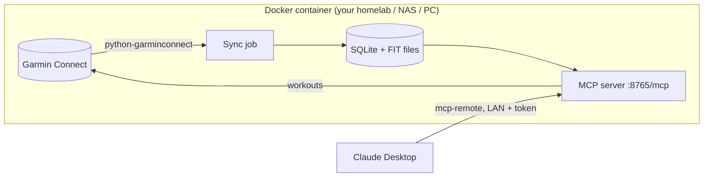

# garmin-coach-mcp

**Let Claude read your Garmin running data and put workouts on your watch.**

`garmin-coach-mcp` is a small self-hosted service that keeps a local archive of your Garmin Connect
activities (summaries, laps and second-by-second data from the original FIT files) and exposes it to
[Claude Desktop](https://claude.ai/download) through the [Model Context Protocol](https://modelcontextprotocol.io).
It can also create structured workouts and schedule them in your Garmin calendar.

No more exporting CSV files after every run: you just ask.

> *"Sync and analyse this morning's run: how did my heart rate drift in the last 5 km?"*
> *"Compare my long runs of the last 8 weeks: pace, heart rate, cadence."*
> *"Put Wednesday's session on my watch: 15' easy, 3 × 2 km at 5:40–5:45 with 2' jog, 10' cool-down."*

🇮🇹 [Leggi in italiano](README.it.md)

---

## Contents

- [Features](#features)
- [How it works](#how-it-works)
- [Requirements](#requirements)
- [Installation](#installation)
- [Connecting Claude Desktop](#connecting-claude-desktop)
- [Personal notes for Claude](#personal-notes-for-claude)
- [Tools](#tools)
- [Structured workouts](#structured-workouts)
- [Configuration](#configuration)
- [Maintenance](#maintenance)
- [Troubleshooting](#troubleshooting)
- [Data, privacy and security](#data-privacy-and-security)
- [Limitations and disclaimer](#limitations-and-disclaimer)
- [Credits](#credits)

---

## Features

**Your history, always available**
- Imports your whole activity history once, then syncs new activities every 30 minutes (or on demand).
- For every run it stores the original FIT file and extracts laps and second-by-second records:
  pace, heart rate, cadence, running dynamics (ground contact time and balance, vertical oscillation and ratio,
  step length), power, altitude, GPS.
- Grade-adjusted pace per lap and the shoes assigned in Garmin Connect.

**Analysis-ready tools for Claude**
- Single activity: summary, laps (same content as Garmin's per-lap CSV), time in heart-rate bands,
  heart-rate recovery at 60".
- Time series at any resolution, for cardiac drift, blow-ups, interval analysis.
- Weekly summaries: volume, long run, training load, intensity distribution.
- Read-only SQL for anything else (trends over months, comparisons, records).
- Annotations for what Garmin doesn't know or gets wrong: real temperature, treadmill, shoes, RPE, notes.

**Workouts on your watch**
- Claude writes structured running workouts (warm-up, repeats, recoveries, cool-down, pace or heart-rate targets)
  and schedules them in your Garmin calendar: they appear on the watch at the next sync.
- Always preview first, upload only after your OK.

---

## How it works



- The container talks to Garmin Connect using your own account (same login flow as the Garmin Connect mobile app).
- Everything is stored locally in `./data`: nothing is sent anywhere else.
- Claude Desktop connects to the container over your local network through
  [`mcp-remote`](https://github.com/geelen/mcp-remote), authenticated with a token.

---

## Requirements

| Where | What |
|---|---|
| Server (any always-on machine: homelab VM, NAS, Raspberry Pi 4/5, PC) | Docker + Docker Compose |
| Your computer | [Claude Desktop](https://claude.ai/download) and [Node.js](https://nodejs.org) LTS (for `npx`) |
| Garmin | A Garmin Connect account (MFA supported) |

The server and the computer must be on the same network (or reachable via VPN).

---

## Installation

### 1. Get the code on the server

```bash
git clone https://github.com/fabio983/garmin-coach-mcp.git
cd garmin-coach-mcp
```

### 2. Configure

```bash
cp .env.example .env
openssl rand -hex 32        # copy the output into MCP_TOKEN in .env
nano .env                   # set TZ, BACKFILL_FROM, HR_BANDS...
```

See [Configuration](#configuration) for all options.

### 3. Build

```bash
docker compose build
```

### 4. Log in to Garmin (once)

```bash
docker compose run --rm garmin-coach login
```

Enter email, password and, if enabled, the MFA code. Tokens are saved in `data/tokens/`;
your password is not stored.

> Warnings like `mobile+cffi returned 429` during login are normal: the library tries several login
> strategies and one of the next ones succeeds. What matters is the final `Login OK`.

### 5. Start

```bash
docker compose up -d
docker compose logs -f
```

The first start imports your history since `BACKFILL_FROM`. Each run takes about 7 seconds
(FIT file + splits + gear, with pauses to respect Garmin's rate limits): ~300 runs ≈ 35 minutes.
You will see one `Details <id> (running) ok` line per run and a final `Auto sync: ok` line.

Check that the server answers from your computer:

```bash
curl http://SERVER-IP:8765/healthz      # → ok
```

---

## Connecting Claude Desktop

1. Install **Node.js LTS** on your computer (Windows: `winget install OpenJS.NodeJS.LTS`), then open a new terminal
   and check `node -v`.
2. In Claude Desktop open **Settings → Developer → Edit config**. This opens `claude_desktop_config.json`:
   - Windows: `%APPDATA%\Claude\claude_desktop_config.json`
   - macOS: `~/Library/Application Support/Claude/claude_desktop_config.json`
3. Add the `garmin-coach` block inside `mcpServers`
   (see [`examples/claude_desktop_config.json`](examples/claude_desktop_config.json)):

   ```json
   {
     "mcpServers": {
       "garmin-coach": {
         "command": "npx",
         "args": ["-y", "mcp-remote@latest", "http://SERVER-IP:8765/mcp",
                  "--allow-http", "--transport", "http-only",
                  "--header", "Authorization:${AUTH_HEADER}"],
         "env": { "AUTH_HEADER": "Bearer YOUR_MCP_TOKEN" }
       }
     }
   }
   ```

   If the file already has other keys (e.g. `preferences`), keep them: `mcpServers` goes at the top level,
   separated by a comma. If `mcpServers` already exists, add `garmin-coach` inside it.
4. **Quit Claude completely** (on Windows also from the system tray icon) and reopen it.
   Close Claude *before* saving the file, otherwise it may overwrite your change on exit.
5. **Settings → Developer** should now list `garmin-coach` as *running*.
6. Open a **new** chat and ask: *"What's the status of my Garmin archive?"*

The `Authorization:${AUTH_HEADER}` form (no space after the colon) avoids a known issue with spaces in
arguments on Windows.

---

## Personal notes for Claude

Claude works better when it knows your context: which sensors you use, your heart-rate zones,
your target cadence, which shoes are for what. Put it in `data/athlete.md`:

```bash
cp examples/athlete.example.md data/athlete.md
nano data/athlete.md
docker compose restart
```

The file is appended to the instructions the server gives Claude in every chat. It lives in `data/`,
so it is never committed.

---

## Tools

| Tool | What it does |
|---|---|
| `sync_garmin` | Fetch new activities now (`full=true` re-imports everything in background) |
| `sync_status` | Archive counts, period covered, result of the latest syncs |
| `list_activities` | Activities in a date range, filterable by type |
| `get_activity` | Summary, laps, HRR60, time in HR bands, annotations (`latest`, a date or an id) |
| `get_activity_series` | Second-by-second data averaged every N seconds, optionally in a time window |
| `training_summary` | Weekly summary: runs, km, time, pace, longest run, load, HR distribution |
| `annotate_activity` | Save real temperature, humidity, treadmill, shoes, session type, RPE, HRR, notes |
| `query_sql` | Read-only SQL on the archive (schema in the tool description) |
| `create_workout` | Build a structured running workout; preview → confirm → upload and schedule |
| `get_workout` | Show the steps of a workout stored in Garmin Connect |
| `list_workouts` | Scheduled workouts and latest ones in your library |
| `delete_workout` | Unschedule and/or delete a workout (only when you ask) |

---

## Structured workouts

Claude builds workouts from a simple step list. You don't need to write it yourself:
describe the session in plain words and Claude translates it. For reference:

```json
[
  {"kind": "warmup", "time": "15:00", "hr": "120-145", "note": "easy"},
  {"repeat": 4, "steps": [
    {"kind": "interval", "distance_m": 100, "note": "stride"},
    {"kind": "recovery", "time": "0:45", "note": "walk"}
  ]},
  {"repeat": 3, "steps": [
    {"kind": "interval", "distance_km": 2, "pace": "5:40-5:45"},
    {"kind": "recovery", "time": "2:00", "note": "easy jog"}
  ]},
  {"kind": "cooldown", "time": "10:00"}
]
```

| Field | Values |
|---|---|
| `kind` | `warmup`, `interval`, `recovery`, `rest`, `cooldown`, `other` |
| duration (one) | `time` (`"mm:ss"`), `distance_km`, `distance_m`, `lap: true` (until lap button) |
| target (optional, one) | `pace` (`"m:ss-m:ss"` per km) or `hr` (`"min-max"` bpm) |
| `note` | Short text shown on the watch for that step |
| repeat | `{"repeat": N, "steps": [...]}`, can be nested |

Garmin targets always have two limits. For "slower than 7:00/km" use a wide range (e.g. `7:00-7:45`)
or a heart-rate cap (e.g. `hr: "120-145"`).

Flow: Claude shows a **preview**, you confirm, then it uploads the workout and (with a date) schedules it.
Use `replace_workout_id` to rewrite an existing workout while keeping its calendar dates.

---

## Configuration

All settings live in `.env` (see [`.env.example`](.env.example)).

| Variable | Default | Description |
|---|---|---|
| `MCP_TOKEN` | – | Bearer token required by the MCP endpoint. **Set it.** |
| `TZ` | – | Timezone, e.g. `Europe/Rome` |
| `BACKFILL_FROM` | `2024-01-01` | Start date of the first import |
| `SYNC_INTERVAL_MIN` | `30` | Background sync interval (0 = on demand only) |
| `REQUEST_DELAY_S` | `1.5` | Pause between Garmin requests |
| `HR_BANDS` | `135,150,160,170` | Lower bounds of HR bands 2..N for time-in-zone |
| `DETAIL_TYPE_MATCH` | `run` | Activity types (substring of Garmin `typeKey`) for which FIT/laps/records are downloaded |
| `GARMIN_EMAIL` / `GARMIN_PASSWORD` | – | Optional, for automatic re-login (not usable with MFA) |
| `ATHLETE_FILE` | `/data/athlete.md` | Personal notes appended to the instructions for Claude |
| `MCP_PORT` | `8765` | Port inside the container |

---

## Maintenance

| Task | Command |
|---|---|
| Update | `git pull && docker compose up -d --build`, then restart Claude Desktop |
| Re-login (tokens expired, `auth_required`) | `docker compose run --rm garmin-coach login && docker compose restart` |
| Manual sync | `docker compose exec garmin-coach python -m app sync [--since 2026-01-01] [--full]` |
| Rebuild laps/records from FIT files | `docker compose exec garmin-coach python -m app reparse` |
| Backup | Copy the `data/` folder |
| Logs | `docker compose logs -f` |

Garmin tokens last several months. With MFA enabled the re-login is interactive; Claude will tell you
when `sync_status` reports `auth_required`.

---

## Troubleshooting

| Symptom | Cause / fix |
|---|---|
| `429` warnings during login | Normal if the login ends with `Login OK`. If it fails, wait an hour: Garmin rate-limits login attempts per IP. Don't retry in a loop. |
| `curl .../healthz` returns `unauthorized` | Wrong path (only `/healthz` is open without token). |
| Claude: *"Unexpected non-whitespace character after JSON"* | The block was pasted outside the main `{ }` of `claude_desktop_config.json`. Validate the file with any JSON validator. |
| `garmin-coach` not listed in Settings → Developer | Invalid config file, or Claude was open while you saved it. Quit Claude (tray too), fix, reopen. |
| Server listed as failed, log says `npx` not found | Node.js missing, or installed while Claude was open. Reboot Claude, or use the full path (`C:\\Program Files\\nodejs\\npx.cmd`). |
| New tools not visible after an update | Restart Claude Desktop and open a new chat. |
| `rate_limited` in `sync_status` | Garmin returned 429 during sync. It resumes automatically at the next run; increase `REQUEST_DELAY_S` if frequent. |

---

## Data, privacy and security

- All data stays in `./data` on your server: SQLite database, original FIT files, Garmin tokens, your notes.
  `data/` and `.env` are excluded by `.gitignore`.
- The Garmin tokens in `data/tokens/` give access to your Garmin account: protect that folder like a password.
- The MCP endpoint is plain HTTP protected by a bearer token: **keep it on your LAN** (or behind a VPN).
  Do not expose port 8765 to the internet.
- `query_sql` opens the database read-only. The only writes Claude can make are annotations
  and, after your confirmation, workouts in Garmin Connect.

---

## Limitations and disclaimer

- This project is **not affiliated with or endorsed by Garmin**. It uses the unofficial Garmin Connect API
  through [python-garminconnect](https://github.com/cyberjunky/python-garminconnect), like many other open-source
  projects. Garmin may change it at any time and break the login or the data access.
  Your archive stays available locally even if that happens.
- Use it with your own account only and with reasonable request rates.
- Workouts: running only for now (no strength, cycling or swimming).
- Works with Claude Desktop while your computer is on and on the same network as the server.
  Remote access (claude.ai web/mobile) would require HTTPS and proper authentication: not included.
- This is just a personal project that I wanted to share with the community. Enjoy!

---

## Credits

This project stands on the shoulders of these open-source projects:

| Project | Role | License |
|---|---|---|
| [python-garminconnect](https://github.com/cyberjunky/python-garminconnect) by cyberjunky | Garmin Connect API wrapper and login | MIT |
| [fitdecode](https://github.com/polyvertex/fitdecode) by polyvertex | FIT file parsing | MIT |
| [MCP Python SDK](https://github.com/modelcontextprotocol/python-sdk) | MCP server | MIT |
| [Uvicorn](https://github.com/encode/uvicorn) | ASGI server | BSD-3-Clause |
| [mcp-remote](https://github.com/geelen/mcp-remote) by geelen | Bridge between Claude Desktop and remote MCP servers | MIT |

Full list, including transitive dependencies and trademark notices: [THIRD_PARTY_NOTICES.md](THIRD_PARTY_NOTICES.md).

## License

[MIT](LICENSE)
